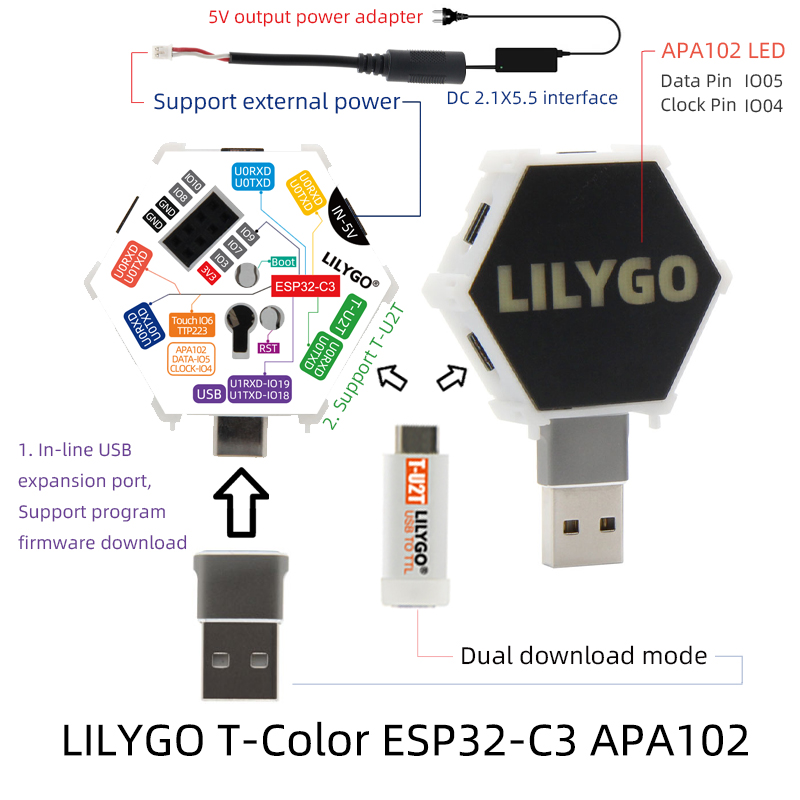

# T-Color

<h1 align = "center">🌟LILYGO T-Color🌟</h1>

## **[English](./README.MD) | [中文](./README_CN.MD)**

<h3 align = "left">Quick start:</h3>

1. Install the current upstream Arduino IDE at the 1.8 level or later. The current version is at the [Arduino website](http://www.arduino.cc/en/main/software).
2. Start Arduino and open Preferences window. In additional board manager add url: https://raw.githubusercontent.com/espressif/arduino-esp32/gh-pages/package_esp32_index.json .separating them with commas.
3. Select Tools -> Board Management -> Search for ESP32 and install
4. Select Tools -> Board -> ESP32C3 Dev Module
5. Copy the folder in the 'lib' directory to '~Arduino/libraries'
6. Need to install the following dependencies

[Adafruit_DotStar](https://github.com/adafruit/Adafruit_DotStar)

<h3 align = "left">Product 📷:</h3>

| Product |                           Product  Link                            |
| :-----: | :----------------------------------------------------------------: |
| T-Color | [AliExpress](https://pt.aliexpress.com/item/1005003930136483.html) |

## Pinout

