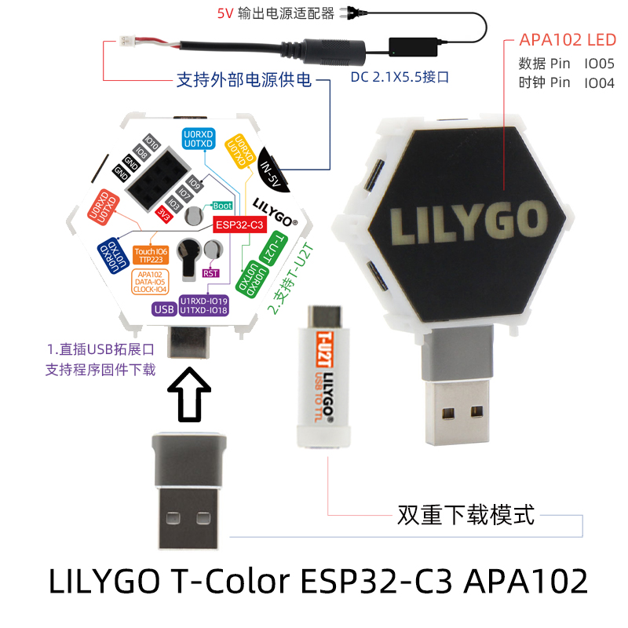

<h1 align = "center">🌟LILYGO T-Color🌟</h1>

## **[English](./README.MD) | [中文](./README_CN.MD)**

<h3 align = "left">快速开始:</h3>

1. 安装 Arduino IDE  [Arduino website](http://www.arduino.cc/en/main/software).
2. 打开Arduino，打开“文件” ->“首选项”，附加开发板管理器的url添加: https://raw.githubusercontent.com/espressif/arduino-esp32/gh-pages/package_esp32_index.json 
3. 选择“工具” -> 开发板选择 -> ESP32C3 Dev Module
4. 复制'lib'下的文件到'~Arduino/libraries'
5. 需要依赖的库
   [Adafruit_DotStar](https://github.com/adafruit/Adafruit_DotStar)

<h3 align = "left">Product 📷:</h3>

| Product |                                                Product  Link                                                |
| :-----: | :---------------------------------------------------------------------------------------------------------: |
| T-Color | [淘宝](https://item.taobao.com/item.htm?spm=a1z10.3-c-s.w4002-23579470099.9.1005566dyFTp8O&id=668475165844) |

## Pinout

