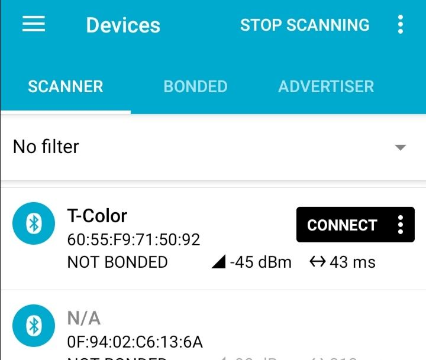
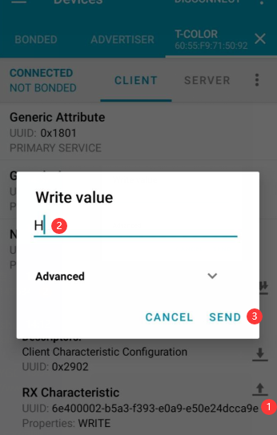
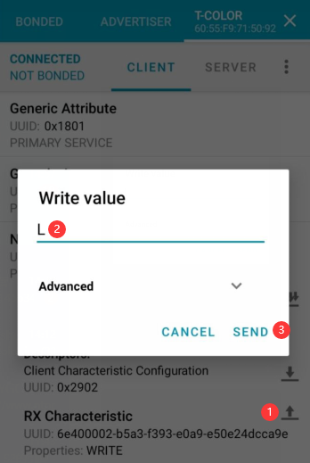

<h1 align = "center">🌟LILYGO T-Color🌟</h1>

1. You will need to install "nRF Connect"
2. Activate Bluetooth and connect to "T-Color"
 

3. Send 'H' to ON the relay

1. Send 'L' to OFF the relay
 
